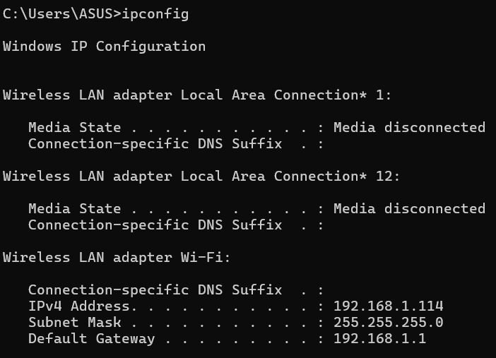
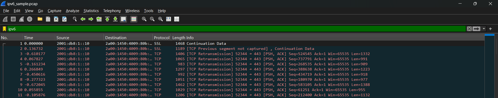

# Laporan Praktikum Jaringan Komputer Modul 10
IP

# Tujuan Praktikum
1. Mahasiswa dapat menginvestigasi cara kerja protokol IP menggunakan Wireshark

# A. Apa itu IP Address
IP Address (Internet Protocol Address) adalah serangkaian angka pengenal unik yang diberikan kepada setiap perangkat keras (seperti komputer, ponsel pintar, atau peladen) yang terhubung ke dalam sebuah jaringan komputer dan menggunakan Protokol Internet untuk berkomunikasi.
untuk melakukan pengecekan ip bisa dilakukan dengan cara mengetik "ipconfig" pada cmd

# B. Traceroute dari suatu website
Tahapan berikutnya adalah menjalankan perintah traceroute menuju alamat gaia.cs.umass.edu. Secara fungsional, traceroute melacak jalur paket data dari perangkat lokal ke alamat tujuan dan mencatat setiap hop atau titik perantara yang dilewati.Rute yang dilalui mencakup jaringan awal (gateway lokal), jaringan internasional atlas.cogentco.com, dan bermuara di infrastruktur gw.umass.edu. Di samping melacak rute perjalanan data dan mengukur waktu respons di setiap titiknya, hasil ini juga menunjukkan adanya beberapa titik yang menolak memberikan respons pelacakan (Request timed out). Untuk memperjelas konsep ini, beberapa contoh implementasi traceroute pada situs lain disajikan sebagai berikut.

# C. apa itu ICMP, MTU, dan TTL
1. ICMP (Internet Control Message Protocol)
ICMP adalah protokol jaringan yang berfungsi sebagai sistem pelaporan kesalahan dan alat diagnostik utama pada Protokol Internet (IP). Berbeda dengan protokol yang dirancang untuk mengangkut data pengguna (seperti TCP atau UDP), ICMP digunakan oleh perangkat jaringan, seperti perute (router), untuk mengirimkan pesan operasional. Protokol ini bertugas memberikan informasi jika terjadi kendala pada jaringan, misalnya menginformasikan bahwa peladen tujuan tidak dapat dijangkau. Perintah pengujian jaringan yang umum digunakan, seperti ping dan traceroute, beroperasi menggunakan protokol ICMP ini.

2. MTU (Maximum Transmission Unit)
MTU merupakan ukuran batasan maksimal sebuah paket data—dinyatakan dalam satuan bita (byte)—yang dapat ditransmisikan melalui sebuah antarmuka jaringan dalam satu kali pengiriman, tanpa harus melalui proses pemecahan data (fragmentasi). Sebagai analogi sederhana, MTU bekerja layaknya batas muatan maksimal pada sebuah truk ekspedisi; apabila ukuran data melebihi kapasitas MTU jaringan yang dilewatinya, data tersebut wajib dipecah menjadi paket-paket yang lebih kecil agar dapat diteruskan. Pada jaringan Eternet standar, ukuran MTU yang lazim digunakan adalah 1500 byte.

3. TTL (Time to Live)
TTL adalah sebuah nilai batasan waktu atau jumlah maksimal lompatan (hop limit) yang disematkan pada sebuah paket data. Fungsi utamanya adalah untuk mencegah paket data berputar-putar tanpa henti (infinite loop) akibat kesalahan rute di dalam jaringan internet. Mekanismenya bekerja dengan cara mengurangi nilai TTL sebanyak satu poin setiap kali paket data melewati sebuah router (satu hop). Apabila nilai TTL telah menyentuh angka nol sebelum paket berhasil mencapai tujuannya, router terakhir akan membuang paket tersebut dan mengirimkan pesan peringatan batas waktu (Time Exceeded) kepada perangkat pengirim.

# D. Mencari Contoh Fragmentasi di Wireshark
Fragmentasi adalah proses pemecahan sebuah paket data yang berukuran besar menjadi beberapa paket yang lebih kecil (disebut fragmen).
1. Jalankan wireshark dan pilih interface wifi
2. Buka cmd
3. lakukan ping dengan mengetik "ping google.com -l 2000"
4. pada wireshark pada bagian filter isi dengan "ip.flags.mf == 1 || ip.frag_offset > 0"

lihat komunikasi dari alamat IP sumber 192.168.1.114 menuju alamat tujuan 74.125.68.100. Komunikasi ini berupa permintaan ping (protokol ICMP). Karena ukuran data ping yang dikirimkan melebihi batas kapasitas jaringan (MTU), paket tersebut harus dipecah.
Hal ini dibuktikan dengan adanya paket IPv4 berukuran 1514 bytes dengan keterangan "Fragmented IP protocol", yang kemudian diikuti oleh paket ICMP yang membawa sisa kepingan data. Aplikasi kemudian menyatukan kepingan informasi tersebut secara virtual untuk keperluan analisis (ditandai dengan keterangan "Reassembled in 123").
Pada kolom Info di baris paket ICMP, terdapat keterangan "no response found!". Hal ini mengindikasikan bahwa paket ping request yang dikirim (meskipun sudah difragmentasi) tidak mendapatkan balasan dari perangkat atau peladen tujuan.

# E. Mencari IPv6 di Wireshark
Selanjutnya adalah mencoba mencari IPv6 di wireshark setelah melakukan penerapannya dengan menggunakan filter "ipv6". dengan menggunakan file sample yang diberikan. terdapat beberapa source dan destination yang terbaca setelah melakukan filter tersebut.

