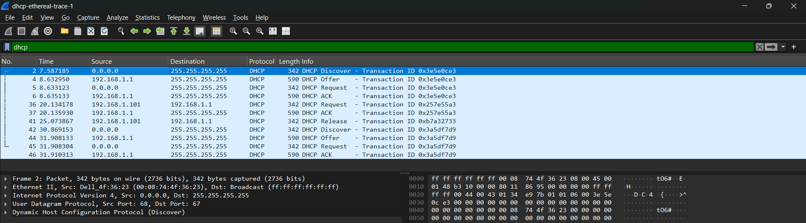

# Laporan Praktikum Jaringan Komputer Modul 11
DHCP

# Tujuan Praktikum
1. Mahasiswa dapat menginvestigasi cara kerja protokol DHCP menggunakan Wireshark.

# A. Apa itu DHCP ?
DHCP adalah sebuah protokol manajemen jaringan yang berfungsi untuk mendistribusikan alamat IP (IP Address) beserta parameter konfigurasi jaringan pendukung lainnya (seperti Subnet Mask, Default Gateway, dan peladen DNS) secara otomatis kepada setiap perangkat yang terhubung ke dalam suatu jaringan.

# B. Kelebihan dan kekurangan DHCP
## Kelebihan
1. Konfigurasi IP otomatis.
2. Pencegahan konflik alamat IP.
3. Kemudahan mobilitas perangkat.
4. Manajemen jaringan terpusat.
## Kekurangan
1. Ketergantungan penuh pada peladen.
2. Rentan terhadap isu keamanan jaringan.
3. Peningkatan lalu lintas pesan broadcast.
4. Tidak sesuai untuk perangkat dengan IP statis.

# C. DORA
DORA adalah singkatan dari Discover, Offer, Request, dan Acknowledge, yang merupakan empat tahapan komunikasi utama yang terjadi saat sebuah perangkat (klien) meminta alamat IP kepada peladen DHCP.

Berikut adalah tahapan lengkapnya:
1. D - Discover: Perangkat klien mengirimkan pesan siaran (broadcast) ke seluruh jaringan untuk melacak dan mencari keberadaan peladen DHCP yang aktif.
2. O - Offer: Peladen DHCP yang menerima pesan tersebut merespons dengan menawarkan ketersediaan sebuah alamat IP kepada klien.
3. R - Request: Klien menyetujui tawaran tersebut dan mengirimkan pesan permintaan resmi kepada peladen untuk meminjam alamat IP yang ditawarkan.
4. A - Acknowledge: Peladen DHCP memberikan konfirmasi persetujuan akhir (acknowledgment) beserta data konfigurasi jaringan, sehingga klien resmi mendapatkan alamat IP dan dapat terhubung ke jaringan.

## Contoh DORA

1. D - Discover (Paket No. 2): Perangkat klien yang belum memiliki alamat IP (tercatat pada kolom Source sebagai 0.0.0.0) mengirimkan pesan broadcast ke tujuan 255.255.255.255 untuk mencari peladen DHCP yang aktif di dalam jaringan.
2. O - Offer (Paket No. 4): Peladen DHCP yang menggunakan alamat IP 192.168.1.1 merespons pencarian tersebut dengan menawarkan sebuah alamat IP (dan konfigurasi lainnya) kepada klien.
3. R - Request (Paket No. 5): Klien (masih berstatus alamat IP 0.0.0.0) mengirimkan pesan balasan broadcast untuk menyetujui tawaran peladen dan secara resmi meminta penggunaan alamat IP tersebut.
4. A - Acknowledge (Paket No. 6): Peladen DHCP (192.168.1.1) mengirimkan pesan persetujuan akhir (DHCP ACK) sebagai validasi bahwa klien kini berhak menggunakan alamat IP yang ditawarkan tersebut untuk terhubung ke jaringan.