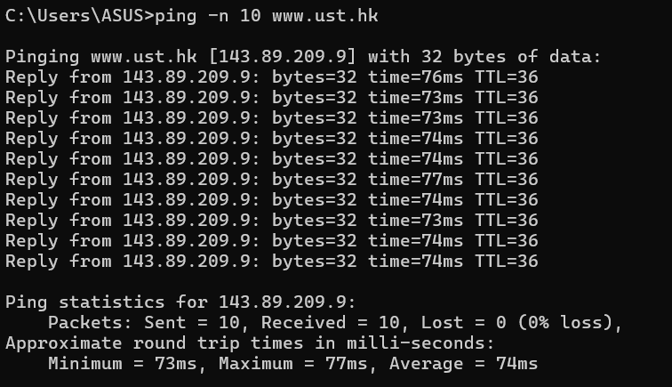
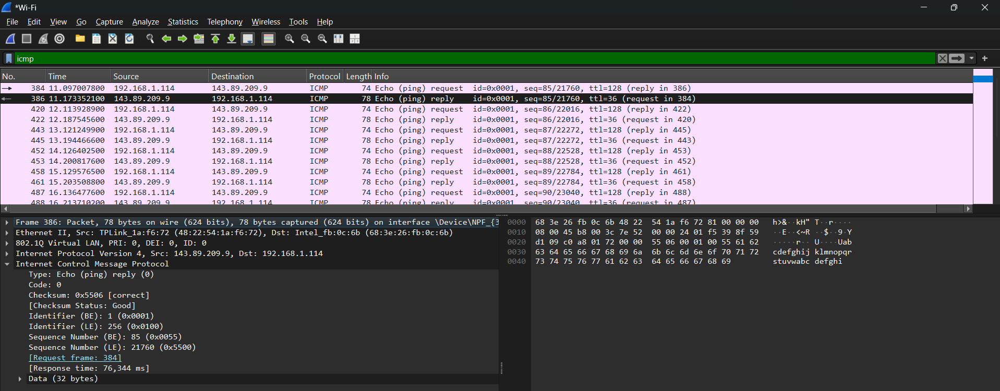
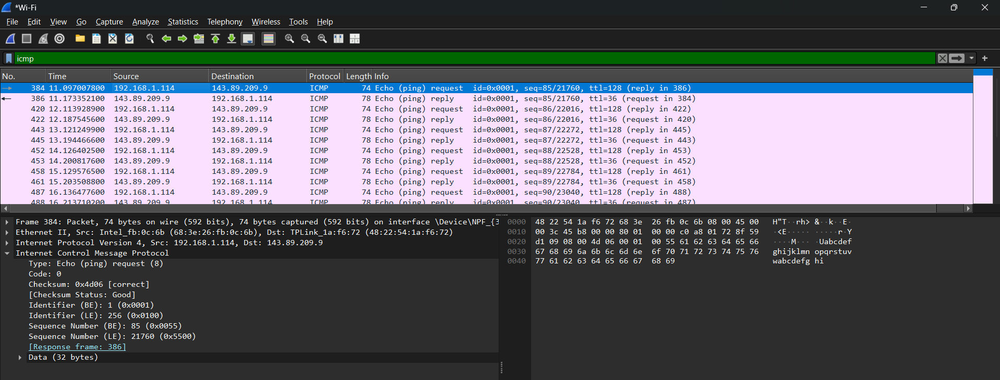
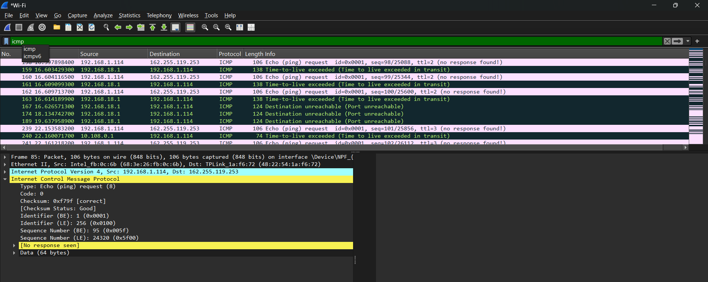

# Laporan Praktikum Jaringan Komputer Modul 12
ICMP

# Tujuan Praktikum
1. Mahasiswa dapat menginvestigasi cara kerja protokol ICMP menggunakan Wireshark
2. Mahasiswa dapat membuat program ICMP Pinger

## Apa itu ICMP?
ICMP adalah protokol pada lapisan jaringan (network layer) yang digunakan oleh perangkat-perangkat di dalam jaringan—seperti perute (router), peladen (server), dan komputer klien—untuk mendiagnosis masalah komunikasi jaringan dan melaporkan pesan kesalahan operasional.

## Fungsi ICMP
1. Pelaporan pesan kesalahan operasional jaringan.
2. Pengujian status konektivitas antarperangkat.
3. Pelacakan titik rute perjalanan paket data.
4. Pemberitahuan kegagalan pencapaian alamat tujuan.
5. Pengalihan ke jalur perutean yang lebih optimal.

## Cara kerja ICMP
Secara prinsip, cara kerja ICMP berpusat pada mekanisme pelaporan status dan kondisi pengiriman paket data di dalam jaringan. Berikut adalah alur kerjanya secara berurutan:

1. Deteksi Anomali atau Permintaan: Saat sebuah paket data (IP) sedang dalam perjalanan, perangkat perantara seperti perute (router) atau perangkat tujuan mendeteksi adanya masalah (misalnya batas waktu TTL habis atau alamat tujuan tidak ditemukan). Selain itu, proses ini juga bisa dipicu oleh permintaan diagnostik secara sengaja, seperti perintah ping.

2. Pembuatan Pesan: Perangkat yang menemukan kendala tersebut akan menghasilkan sebuah pesan ICMP khusus. Pesan ini berisi informasi mengenai jenis kesalahan (Type) dan kode rinciannya (Code), serta salinan sebagian kecil dari data IP asli yang bermasalah.

3. Enkapsulasi (Pembungkusan): Pesan ICMP yang telah dibuat tidak menggunakan protokol transportasi seperti TCP atau UDP, melainkan langsung dibungkus (dienkapsulasi) ke dalam paket IP (Internet Protocol) yang baru.

4. Pengiriman Balik: Paket IP baru yang bermuatan pesan ICMP tersebut kemudian dialihkan dan dikirimkan kembali ke alamat IP sumber (pengirim awal paket).

5. Penerimaan dan Evaluasi: Setelah perangkat pengirim menerima pesan ICMP tersebut, sistem operasi atau aplikasi jaringan pada perangkat akan mengevaluasi informasinya dan memutuskan tindakan selanjutnya (misalnya menampilkan pesan "Request timed out" atau mencoba mencari rute alternatif).

## Langkah-Langkah percobaan
1. Jalankan wireshark dan pilih interface wifi
2. Buka cmd, ketikan perintah "ping -n 10 www.ust.hk"

3. Lalu pada wireshark, stop capture dan filter "icmp"
4. pilih salah satu paket ICMP echo reply

Alamat IP 143.89.209.9 bertindak sebagai sumber pengirim, mengembalikan pesan kepada klien di alamat IP 192.168.1.114.

Pada panel detail di bagian bawah, teridentifikasi bahwa pesan balasan ini memiliki atribut Type: 0 dan Code: 0, yang merupakan definisi untuk pesan ICMP Echo (ping) Reply. Ini membuktikan bahwa peladen tujuan berhasil menerima permintaan awal dan merespons bahwa perangkatnya aktif dan dapat dijangkau.

5. pilih salah satu paket ICMP echo request

Perangkat pengirim (klien) dengan alamat IP sumber 192.168.1.114 mengirimkan paket data menuju alamat IP peladen tujuan 143.89.209.9.

Pada panel detail di bagian bawah, teridentifikasi bahwa pesan ini memiliki atribut Type: 8 dan Code: 0, yang secara standar protokol didefinisikan sebagai pesan ICMP Echo (ping) Request. Ini berarti komputer klien sedang meminta konfirmasi kehadiran dan konektivitas dari komputer tujuan.

## Pesan ICMP yang dihasilkan oleh program Traceroute
1. Jalankan wireshark dan pilih interface wifi
2. Buka cmd, ketikan perintah "tracert www.ust.hk"
3. Lalu pada wireshark, stop capture dan filter "icmp"

Seperti yang ditunjukkan pada gambar berikut, mekanisme pelacakan rute jaringan ini melibatkan dua jenis pesan ICMP utama. Pertama, ketika sebuah paket data kehabisan nilai TTL (mencapai batas 0) di tengah perjalanannya, perute yang menangani paket tersebut akan membuangnya dan membalas pengirim dengan pesan ICMP Time-to-live exceeded. Proses berulang inilah yang memetakan setiap titik perute di sepanjang jalur. Kedua, pelacakan akan memicu pesan Destination Unreachable yang menandakan bahwa paket data akhirnya telah sampai pada perangkat tujuan akhir, atau indikasi bahwa tujuan tersebut sama sekali tidak dapat dijangkau.