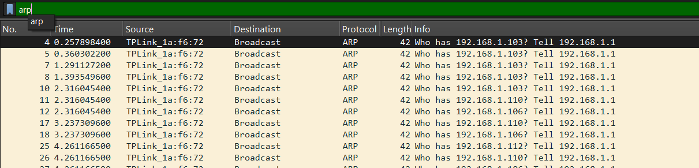
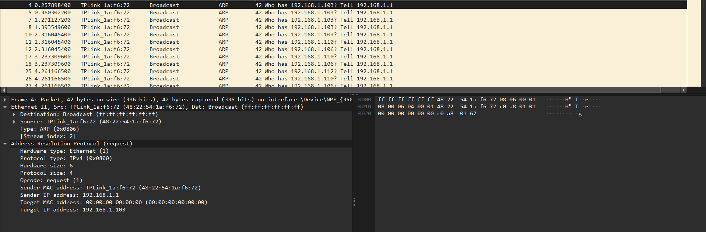

# Laporan Praktikum Jaringan Komputer Modul 13
Ethernet and ARP

# Tujuan Praktikum
1. Mahasiswa dapat menginvestigasi cara kerja Ethernet dan ARP menggunakan Wireshark

ARP (Address Resolution Protocol) adalah protokol jaringan yang berfungsi untuk memetakan atau mengubah alamat IP (layer 3 jaringan) menjadi alamat MAC fisik (layer 2 data link) dalam sebuah jaringan lokal (LAN). Ketika sebuah perangkat ingin mengirim data ke perangkat lain dalam jaringan yang sama, ia menggunakan ARP untuk mengirimkan pesan siaran (broadcast) guna menanyakan dan menemukan alamat MAC tujuan yang sesuai dengan alamat IP sasaran tersebut.

## Cara kerja ARP
1. Perangkat bersiap mengirim data ke host di jaringan lokal yang sama.
2. Memeriksa tabel ARP Cache internal untuk mencari MAC Address tujuan.
3. Jika absen, pesan ARP Request disebarkan secara broadcast ke jaringan.
4. Pemilik IP yang sah membalas dengan ARP Reply berisi alamat MAC-nya.
5. Pasangan IP-MAC disimpan di ARP Cache untuk efisiensi ke depan.
6. Pengiriman data ke target sukses dieksekusi.

## Langkah-Langkah
1. run cmd sebagai admin, lalu ketik arp -d *,berfungsi untuk menghapus seluruh history atau entri yang tersimpan di dalam tabel ARP Cache pada perangkat
2. run wireshark dan pilih interface wifi
3. buka web browser dan masuk ke link http://gaia.cs.umass.edu/wireshark-labs/HTTP-ethereal-lab-file3.html
4. lalu stop capture pada wireshark
5. filter ARP pada wireshark

6. pilih satu paket untuk dianalisis

Berdasarkan hasil capture Wireshark pada gambar, paket yang diamati merupakan ARP Request yang dikirim oleh perangkat dengan IP 192.168.1.1 dan MAC Address 48:22:54:1a:f6:72 untuk mencari MAC Address dari perangkat target yang memiliki IP 192.168.1.103, sehingga karena alamat MAC tujuan belum diketahui maka kolom Target MAC address masih bernilai 00:00:00:00:00:00 dan paket dikirim secara broadcast ke alamat fisik ff:ff:ff:ff:ff:ff agar dapat didengar oleh seluruh perangkat dalam jaringan lokal, lalu perangkat yang kebetulan memiliki IP 192.168.1.103 tersebut nantinya akan merespons dengan pesan ARP Reply yang berisi MAC Address miliknya agar komunikasi data unicast dapat dilakukan.