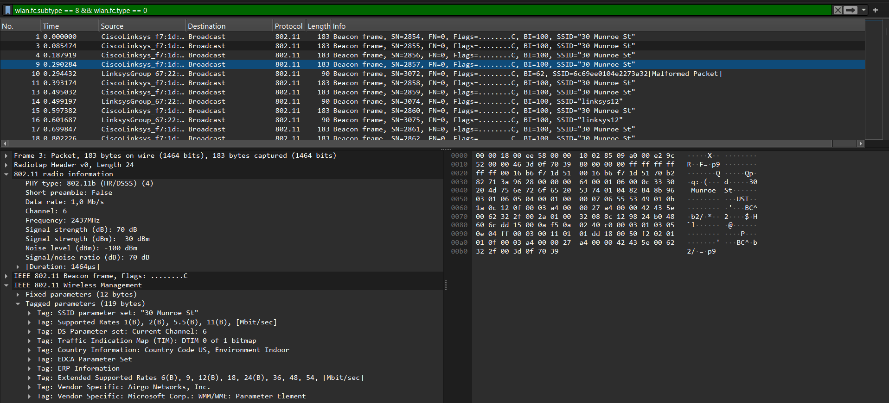
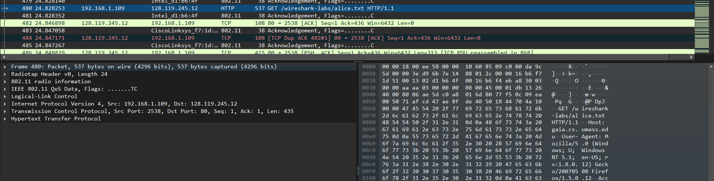
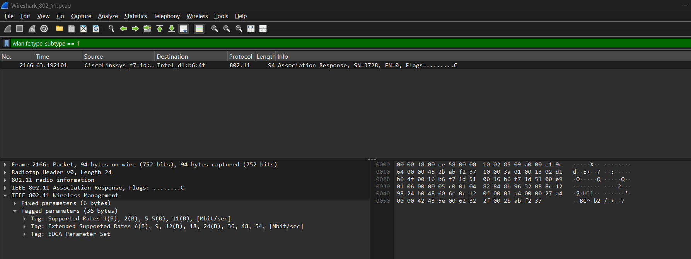
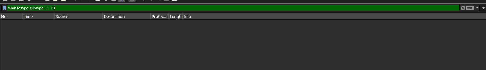

# Laporan Praktikum Jaringan Komputer Modul 14
WIFI

# Tujuan Praktikum
1. Mahasiswa dapat menginvestigasi cara kerja WiFi menggunakan Wireshark.

## Pengantar
IEEE 802.11 merupakan standar komunikasi jaringan nirkabel yang dikembangkan oleh Institute of Electrical and Electronics Engineers (IEEE). Standar ini menjadi dasar teknologi Wi-Fi dan mengatur proses pertukaran data pada jaringan WLAN (Wireless Local Area Network), terutama pada lapisan fisik (Physical Layer) dan lapisan pengendalian akses media (Media Access Control/MAC).

## Perbandingan 2.4 GHz dan 5 GHz
1. 2.4 GHz

Kelebihan: Mampu memancarkan sinyal sangat jauh dan sangat pintar menembus halangan fisik seperti tembok tebal, pintu, atau lantai bertingkat. Hampir semua perangkat (bahkan yang jadul sekalipun) mendukung frekuensi ini.

Kekurangan: Jalur ini sangat padat alias macet. Sinyal 2.4 GHz juga digunakan oleh microwave, Bluetooth, baby monitor, dan Wi-Fi tetangga Anda. Hal ini sering menyebabkan koneksi menjadi tidak stabil atau lambat.

2. 5 GHz 

Kelebihan: Menawarkan kecepatan transfer data yang jauh lebih tinggi dibandingkan 2.4 GHz dan jalurnya jauh lebih lengang (minim gangguan/interferensi). Sangat ideal untuk aktivitas berat yang membutuhkan koneksi stabil tanpa lag.

Kekurangan: Sinyalnya mudah "tersandung" oleh benda padat. Jangkauannya lebih pendek, dan jika ada banyak tembok tebal antara router dan perangkat Anda, sinyalnya akan cepat melemah.

## Langkah-Langkah Analisis Beacon Frame
1. Buka file Wireshark_802_11.pcap pada wireshark
2. ketik filter wlan.fc.subtype == 8 && wlan.fc.type == 0
3. lalu pilih salah satu paket untuk dianalisis

Berdasarkan hasil analisis paket Wireshark pada gambar, terlihat aktivitas pengiriman Beacon Frame secara broadcast yang dilakukan secara periodik setiap sekitar 100 milidetik oleh sebuah Access Point. Melalui pengamatan detail pada Frame 3, diketahui bahwa jaringan nirkabel dengan SSID "30 Munroe St" ini beroperasi pada Channel 6 di frekuensi 2437 MHz (pita 2,4 GHz). Komunikasi tersebut menggunakan standar IEEE 802.11b dengan metode modulasi HR/DSSS serta memanfaatkan Long Preamble (Short preamble: False) untuk proses sinkronisasi guna menjaga kompatibilitas dengan perangkat lama. Kualitas jaringan ini tergolong sangat prima dan stabil, yang dibuktikan oleh kekuatan sinyal (Signal strength) sebesar -30 dBm, tingkat gangguan (Noise level) yang sangat minim di angka -100 dBm, serta Signal-to-noise ratio yang mencapai 70 dB. Selain itu, meskipun parameter Supported Rates menunjukkan kecepatan dasar khas 802.11b (1 hingga 11 Mbps), keberadaan Extended Supported Rates dengan rentang 6 hingga 54 Mbps mengindikasikan bahwa Access Point ini juga memiliki kompatibilitas dengan standar Wi-Fi yang lebih modern untuk mendukung transmisi data yang lebih cepat.

## Analisis Data Transfer
1. buka frame 480

Terlihat adanya inisiasi koneksi antara klien dan server melalui mekanisme TCP Three-Way Handshake (meliputi paket SYN, SYN-ACK, dan ACK). Setelah jalur komunikasi berhasil terbuka, Frame 480 merekam aktivitas klien yang melayangkan permintaan HTTP GET untuk mengambil file /wireshark-labs/alice.txt dari pihak server.

## Analisis Proses Association & Disassociation
1. gunakan filter "wlan.fc.type_subtype == 1" untuk menganalisis tanggapan Asosiasi (Association Response).

Frame ini menampilkan paket Association Response yang merupakan tanggapan Access Point terhadap pendaftaran dari perangkat klien. Dengan Transmitter Address berupa MAC Address CiscoLinksys_f7:1d:51, paket ini mengonfirmasi bahwa permintaan koneksi dari klien Intel_d1:6b:4f telah disetujui. Keberhasilan tahap asosiasi ini memungkinkan perangkat klien untuk segera memulai komunikasi data di dalam jaringan Wi-Fi tersebut.

2. gunakan filter "wlan.fc.type_subtype == 10" untuk menganalisis tanggapan Disasosiasi (Disassociation Response).

dapat dilihat pada file ini tidak ada respon diasosiasi.