# Laporan Praktikum Jaringan Komputer Modul 4
DNS

# Tujuan Praktikum
1. Mahasiswa dapat menginvestigasi cara kerja DNS menggunakan Wireshark

## 4.2 Nslookup
1. Jalankan nslookup untuk mendapatkan alamat IP dari server web di Asia. Berapa alamat IP server tersebut?

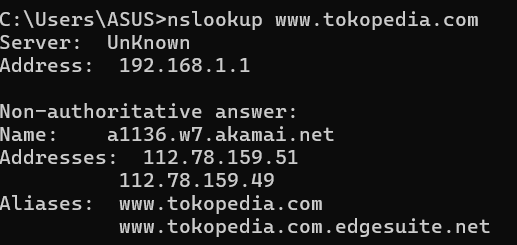

disini saya menguju nslookup pada situs www.tokopedia.com dan dari hasil nslookup saya IP server tokopedia adalah 112.78.159.51 dan 112.78.159.49
2. Jalankan nslookup agar dapat mengetahui server DNS otoritatif untuk universitas di Eropa 
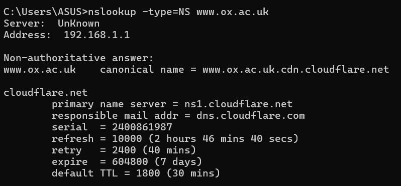

disini saya mencoba untuk website University of oxford yaitu www.ox.ac.uk dan server DNS otoritatifnya adalah ns1.cloudflare.net
3. Jalankan nslookup untuk mencari tahu informasi mengenai server email dari Yahoo! Mail
melalui salah satu server yang didapatkan di pertanyaan nomor 2. Apa alamat IP-nya?
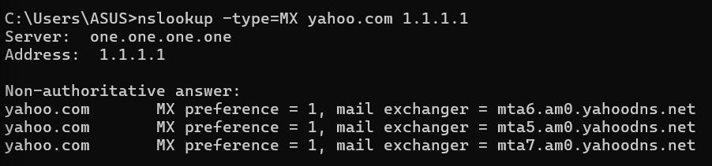

disini kita lakukan nslookup yahoo.com dengan dns 1.1.1.1 yang merupakan cloudflare DNS publik, dapat dilihat yahoo.com memiliki 3 domain mailserver.

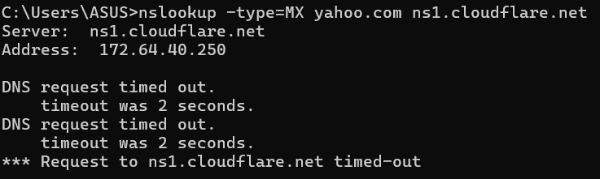

namun jika kita menggunakan ns1.cloudflare.net dari soal nomor 2 akan terjadi timeout dikarenakan server tersebut tidak melayani query eksternal jadi saya menggunakan 1.1.1.1 sebagai gantinya.

## 4.3 ipconfig
Ipconfig dapat digunakan untuk menampilkan informasi mengenai TCP/IP Anda saat ini, termasuk alamat IP Anda, alamat server DNS, jenis adaptor, dan sebagainya. Sebagai contoh, kita dapat memperoleh semua informasi tentang host Anda hanya dengan memasukkan perintah ipconfig /all.
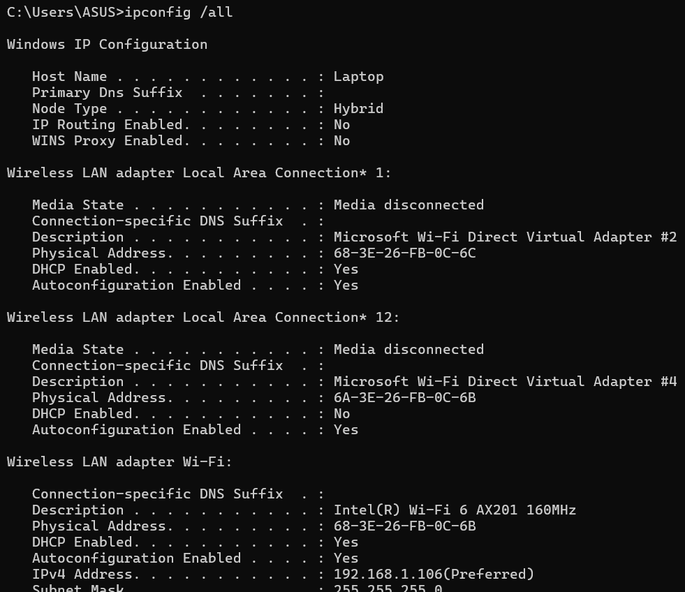

Untuk mengecek DNS dapat menjalankan ipconfig /displaydns
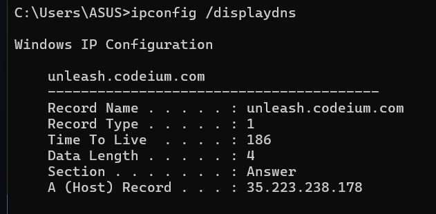

Hasil yang didapatkan merupakan tampilan record dan sisa TTL dalam satuan detik.
Untuk menghapus catatan jalankan ipconfig /flushdns
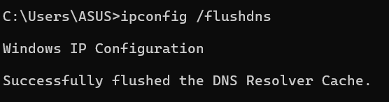

mengosongkan catatan DNS berarti menghapus semua record dan memuat ulang record dari file host.

## 4.4 Tracing DNS dengan wireshark
1. jalankan ipconfig lalu salin ip address sendiri
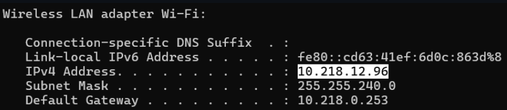
2. jalankan wireshark dan masuk ke web www.ietf.org lalu tambahkan filter ip.addr == (ip sendiri)&& dns.qry.name contains "ietf".
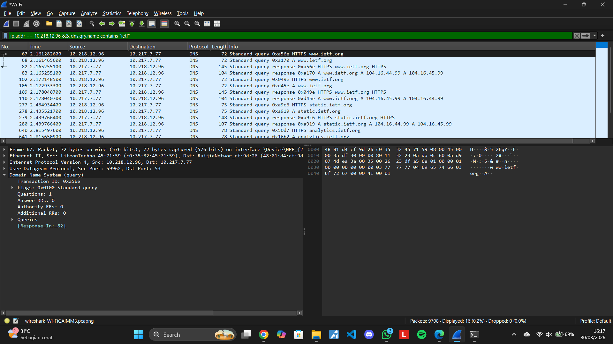

### Jawaban pertanyaan 1
1. Cari pesan permintaan DNS dan balasannya. Apakah pesan tersebut dikirimkan melalui UDP atau TCP
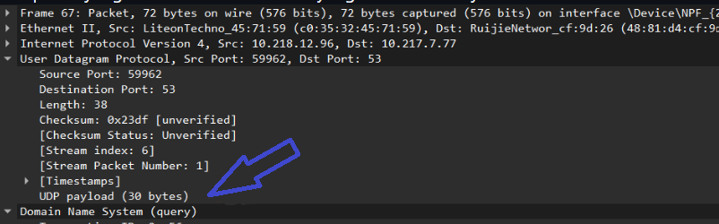

pesan tersebut dikirim melalui UDP.

2. Apa port tujuan pada pesan permintaan DNS? Apa port sumber pada pesan balasannya?
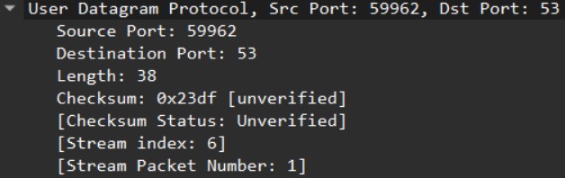

port source(sumber) nya 59962 dan port destination(tujuan) nya 53

3. Pada pesan permintaan DNS, apa alamat IP tujuannya? Apa alamat IP server DNS lokal anda (gunakan ipconfig untuk mencari tahu)? Apakah kedua alamat IP tersebut sama?

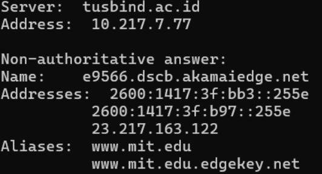
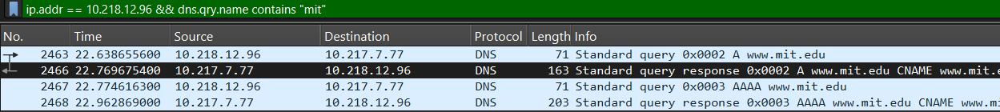

ya alamat ip tujuan dan server dns lokal sama.

4. Periksa pesan permintaan DNS. Apa “jenis” atau ”type” dari pesan tersebut? Apakah pesan permintaan tersebut mengandung ”jawaban” atau ”answers”?

Type A dan juga AAAA, ya mengandung answer

5. Periksa pesan balasan DNS. Berapa banyak ”jawaban” atau ”answers” yang terdapat di dalamnya? Apa saja isi yang terkandung dalam setiap jawaban tersebut?

Ada 3 jawaban, isi nya Name,Type,Class, TTL,Data Lenght, dan CNAME.

6. Perhatikan paket TCP SYN yang selanjutnya dikirimkan oleh host Anda. Apakah alamat IP pada paket tersebut sesuai dengan alamat IP yang tertera pada pesan balasan DNS?

ya sudah sesuai dengan saat pengecekan nslookup alaamt 20.189.173.27 adalah salah satu address yang diberikan.

7. Halaman web yang sebelumnya anda akses (http://www.ietf.org) memuat beberapa gambar. Apakah host Anda perlu mengirimkan pesan permintaan DNS baru setiap kali ingin mengakses suatu gambar?

Tidak, karena browser melakukan DNS lookup untuk mendapatkan alamat IP lalu disimpan di cache

### Jawaban pertanyaan 2 nslookup -type=NS mit.edu
1. Ke alamat IP manakah pesan permintaan DNS dikirimkan? Apakah alamat IP tersebut merupakan default alamat IP server DNS lokal Anda?

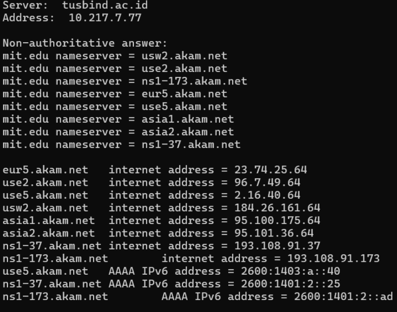

dikirim ke 10.217.7.77

2. Periksa pesan permintaan DNS. Apa ”jenis” atau ”type” dari pesan tersebut? Apakah pesan tersebut mengandung ”jawaban” atau ”answers”?

Type NS, Ya mengandung answers

3. Periksa pesan balasan DNS. Apa nama server MIT yang diberikan oleh pesan balasan? Apakah pesan balasan ini juga memberikan alamat IP untuk server MIT tersebut?

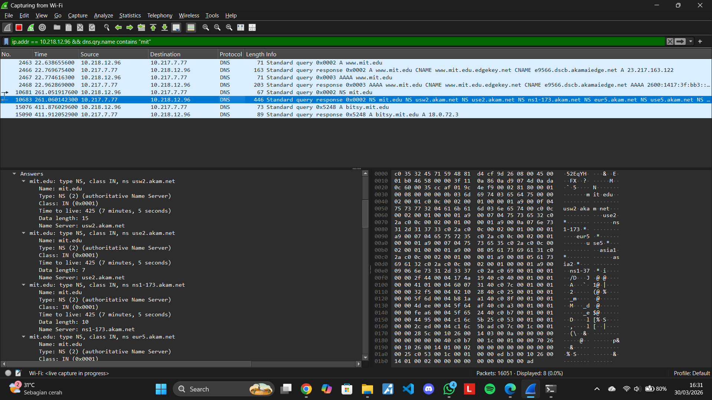

dari jawaban dns hanya mengembalikan Nameserver tidak dengan ip server.

### Jawaban pertanyaan 3 nslookup www.aiitr.or.kr bitsy.mit.edu
1. Ke alamat IP manakah pesan permintaan DNS dikirimkan? Apakah alamat IP tersebut merupakan default alamat IP server DNS lokal Anda?

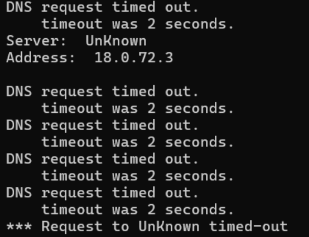

DIkirim ke 18.0.72.3 yaitu IP dari server DNS bitsy.mit.edu

2. Periksa pesan permintaan DNS. Apa ”jenis” atau ”type” dari pesan tersebut? Apakah pesan tersebut mengandung ”jawaban” atau ”answers”?

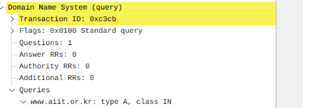

bertipe Queries , tidak ada answers.

3. Periksa pesan balasan DNS. Berapa banyak ”jawaban” atau “answers” yang terdapat di dalamnya. Apa saja isi yang terkandung dalam setiap jawaban tersebut?

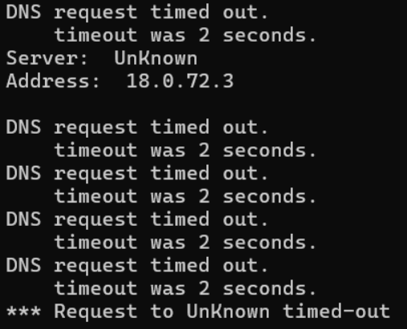

answers tidak diterima karena terjadi timeout pada server DNS

