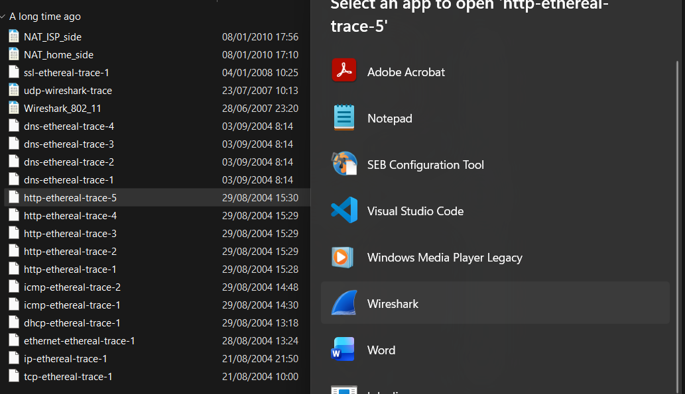
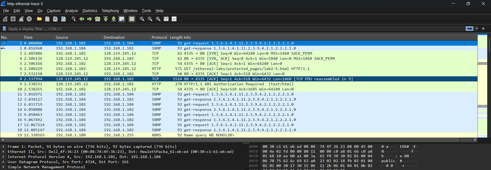
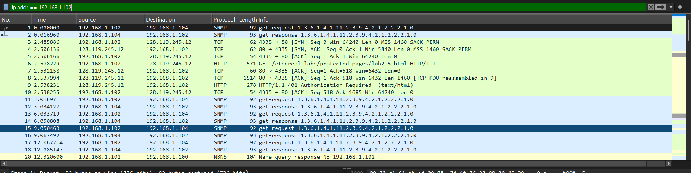
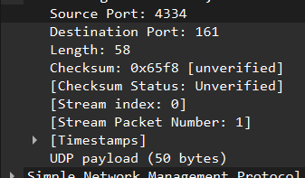
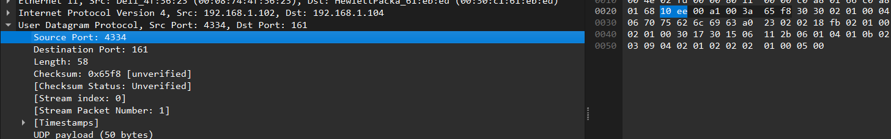
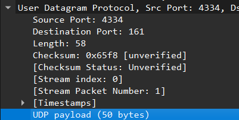
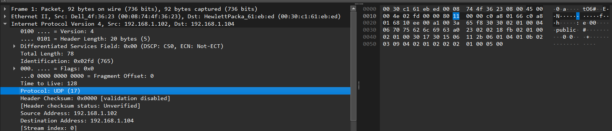
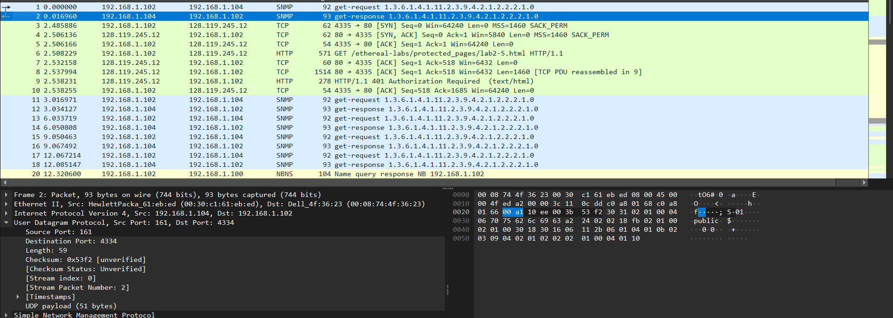

# Laporan Praktikum Jaringan Komputer Modul 5
UDP

# Tujuan Praktikum
1. Mahasiswa dapat menginvestigasi cara kerja protokol UDP menggunakan Wireshark

## Pertanyaan
1. Pilih satu paket UDP yang terdapat pada trace Anda. Dari paket tersebut, berapa banyak “field” yang terdapat pada header UDP? Sebutkan nama-nama field yang Anda temukan!
2. Perhatikan informasi “content field” pada paket yang Anda pilih di pertanyaan 1. Berapa panjang (dalam satuan byte) masing-masing “field” yang terdapat pada header UDP?
3. Nilai yang tertera pada ”Length” menyatakan nilai apa? Verfikasi jawaban Anda melalui paket UDP pada trace.
4. Berapa jumlah maksimum byte yang dapat disertakan dalam payload UDP? (Petunjuk: jawaban untuk pertanyaan ini dapat ditentukan dari jawaban Anda untuk pertanyaan 2)
5. Berapa nomor port terbesar yang dapat menjadi port sumber? (Petunjuk: lihat petunjuk pada pertanyaan 4)
6. Berapa nomor protokol untuk UDP? Berikan jawaban Anda dalam notasi heksadesimal dan desimal. Untuk menjawab pertanyaan ini, Anda harus melihat ke bagian ”Protocol” pada datagram IP yang mengandung segmen UDP.
7. Periksa pasangan paket UDP di mana host Anda mengirimkan paket UDP pertama dan paket UDP kedua merupakan balasan dari paket UDP yang pertama. (Petunjuk: agar paket kedua merupakan balasan dari paket pertama, pengirim paket pertama harus menjadi tujuan dari paket kedua). Jelaskan hubungan antara nomor port pada kedua paket tersebut.

## Langkah-Langkah
1. buka file ethereal trace di wireshark dengan cara klik kanan lalu "open with" lalu pilih wireshark, tekan choose an app jika pilihan wireshark tidak ada

2. tampilan wireshark akan menjadi seperti ini

3. lakukan filter ip.addr==192.168.1.102

## Jawaban Pertanyaan
1. Terdapat 4 field utama di header UDP yaitu Source Port, Destination Port, Lenght, dan Checksum

2. Total panjang field 8 Byte dengan masing masing field berukuran 2 Byte dan total 4 field.

3. dapat dilihat dari gambar jawaban no 1 dilihat length = 58 berarti Total panjang UDP Header(8) + Panjang Payload dari UDP (50).

4. Total lenght pada UDP = 16 bit(2 Byte x 8), jadi nilai maksimum yang dapat direpresentasikan dari 16 bit adalah (216 - 1) = 65535. untuk maximum payload = 65.535 - 8 = 65.527 byte(maksimum oayload UDP).

5. dari jawaban no 4 didapatkan nilai maksimum 65535 jadi itu adalah port terbesar yang bisa digunakan sebagai port sumber.

6. dapat dilihat Protocol UDP menunjukkan 17 dan pada hexadesimal nya menunjukkan angka 11 /0x11

7. dapat dilihat dari gambar dibawah (penerima) sesuai dengan gambar pada no 1(pengirim) port nya sesuai dimana pada gambar dibawah Source nya 161 dan destination nya 4334 dan pada gambar pengirim sebaliknya

