# Laporan Praktikum Jaringan Komputer Modul 6
TCP

# Tujuan Praktikum
1. Mahasiswa dapat menginvestigasi cara kerja protokol TCP menggunakan Wireshark

## Langkah-Langkah
1. buka http://gaia.cs.umass.edu/wireshark-labs/alice.txt pada web browser dan download file txt dengan melakukan klik kanan lalu save as txt
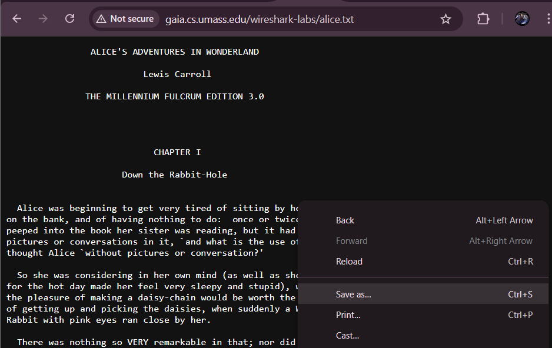
2. jalankan wireshark lalu pergi ke http://gaia.cs.umass.edu/wireshark-labs/TCP-wireshark-file1.html lalu masukkan file alice.txt tadi ke bagian choose file lalu klik "upload alice.txt file"
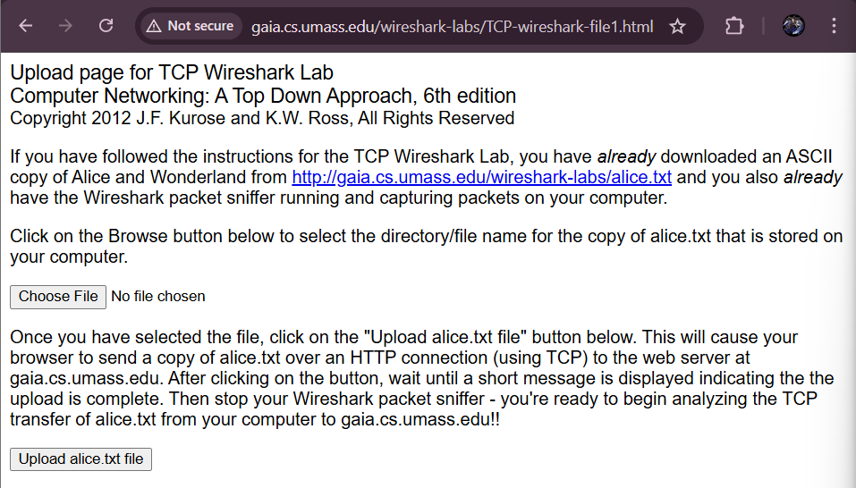
3. setelah upload akan muncul tampilan seperti ini, matikan/stop wireshark
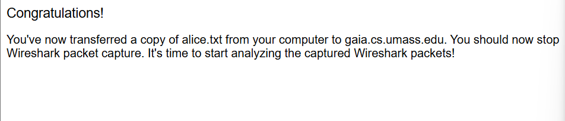

## Jawaban Pertanyaan 1
1. Berapa alamat IP dan nomor port TCP yang digunakan oleh komputer klien (sumber) untuk
mentransfer file ke gaia.cs.umass.edu? Cara paling mudah menjawab pertanyaan ini adalah
dengan memilih sebuah pesan HTTP dan meneliti detail paket TCP yang digunakan untuk
membawa pesan HTTP tersebut.
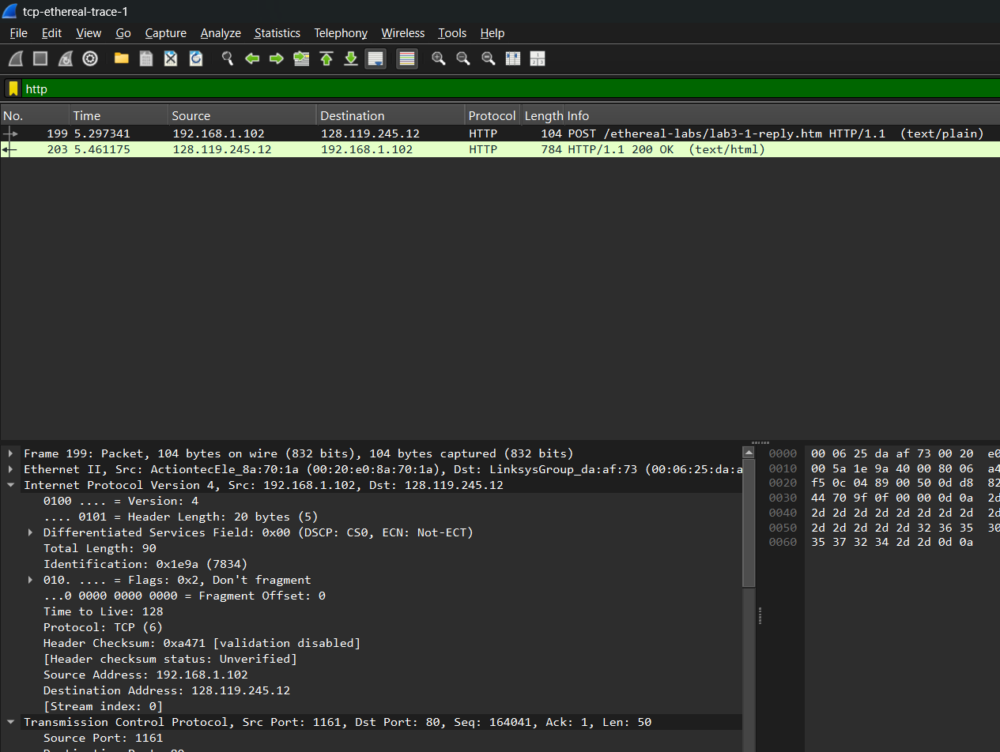

dapat terlihat source IP 192.168.1.102 dengan port 1161

2. Apa alamat IP dari gaia.cs.umass.edu? Pada nomor port berapa ia mengirim dan menerima
segmen TCP untuk koneksi ini?

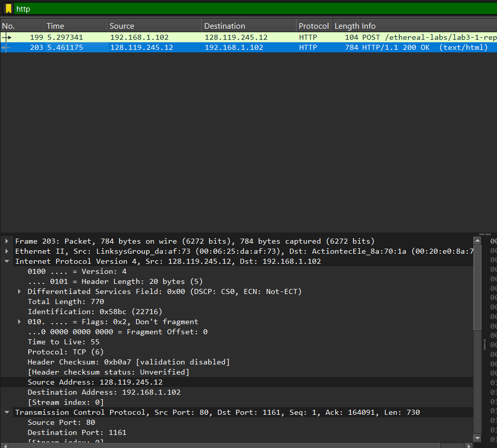

dapat terlihat alamat IP dari gaia.cs.umass.edu adalah 128.119.245.12 dengan port 80

3. Berapa alamat IP dan nomor port TCP yang digunakan oleh komputer klien Anda (sumber) untuk mentransfer ke gaia.cs.umass.edu?
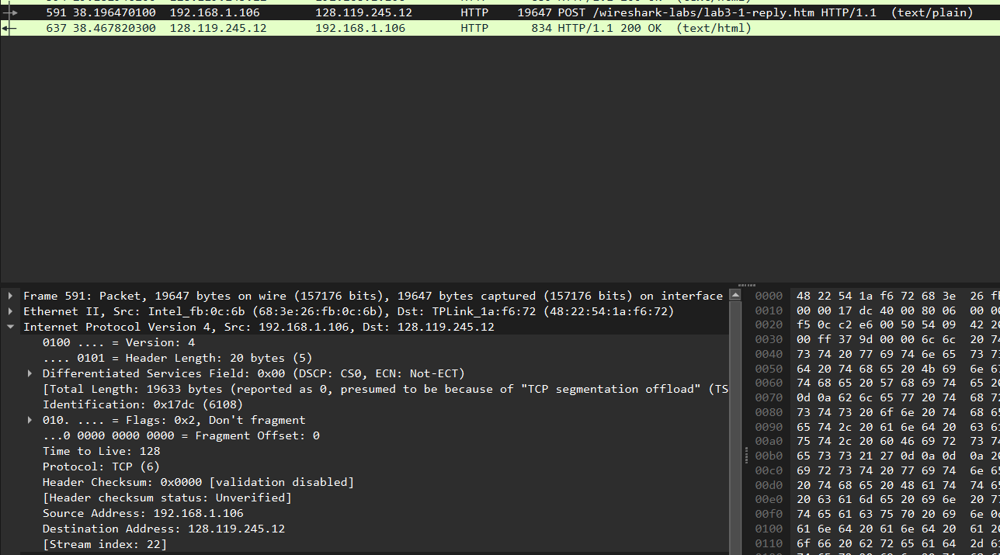

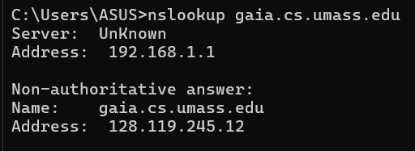

Source: 192.168.1.106 : 49894
Destination : 128.119.245.12 : 80

## Jawaban Pertanyaan 2
1. Berapa nomor urut segmen TCP SYN yang digunakan untuk memulai sambungan TCP antara komputer klien dan gaia.cs.umass.edu? Apa yang dimiliki segmen tersebut sehingga teridentifikasi sebagai segmen SYN?

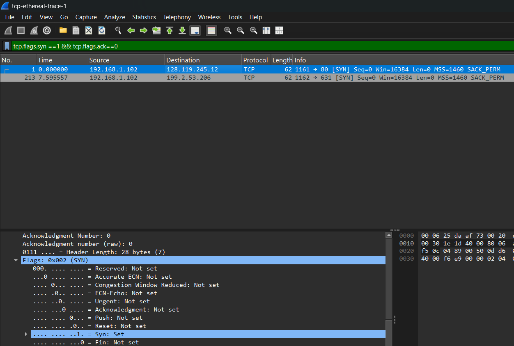
Nomor urut SYN adalah 1 Segmen seperti pada gambar diatas bahwa SYN = 1 dan ACK = 0. ini merupakan 3-way handshake.

2. Berapa nomor urut segmen SYNACK yang dikirim oleh gaia.cs.umass.edu ke komputer klien sebagai balasan dari SYN? Berapa nilai dari field Acknowledgement pada segmen SYNACK? Bagaimana gaia.cs.umass.edu menentukan nilai tersebut? Apa yang dimiliki oleh segmen sehingga teridentifikasi sebagai segmen SYNACK?

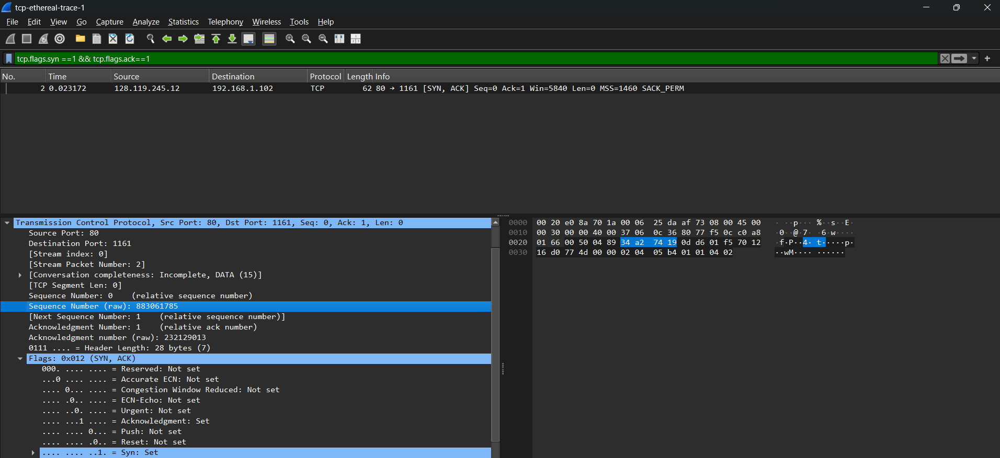

nomor urut SYN ACK adalah 213, artinya 23 + 1 = 24 untuk nilai acknowledgement. gaia menentukan nilai karena setiap flag SYN mengonsumsi 1 no urut.

3. Berapa nomor urut segmen TCP yang berisi perintah HTTP POST? Perhatikan bahwa untuk menemukan perintah POST, Anda harus menelusuri content field milik paket di bagian bawah jendela Wireshark, kemudian cari segmen yang berisi "POST" di bagian field DATAnya.

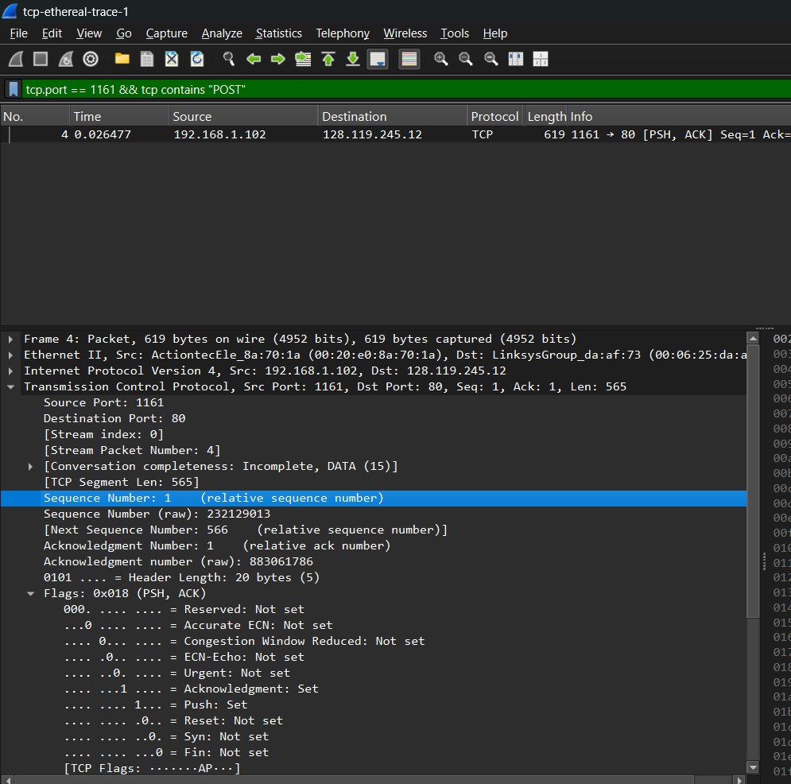

nomor urutnya 199.

4. Anggap segmen TCP yang berisi HTTP POST sebagai segmen pertama dalam koneksi TCP. Berapa nomor urut dari enam segmen pertama dalam TCP (termasuk segmen yang berisi HTTP POST)? Pada jam berapa setiap segmen dikirim? Kapan ACK untuk setiap segmen diterima? Dengan adanya perbedaan antara kapan setiap segmen TCP dikirim dan kapan acknowledgement-nya diterima, berapakah nilai RTT untuk keenam segmen tersebut? Berapa nilai EstimatedRTT setelah penerimaan setiap ACK? (Catatan: Wireshark memiliki fitur yang memungkinkan Anda untuk memplot RTT untuk setiap segmen TCP yang dikirim. Pilih segmen TCP yang dikirim dari klien ke server gaia.cs.umass.edu pada jendela "daftar paket yang ditangkap". Kemudian pilih: Statistics->TCP Stream Graph- >Round Trip Time Graph).

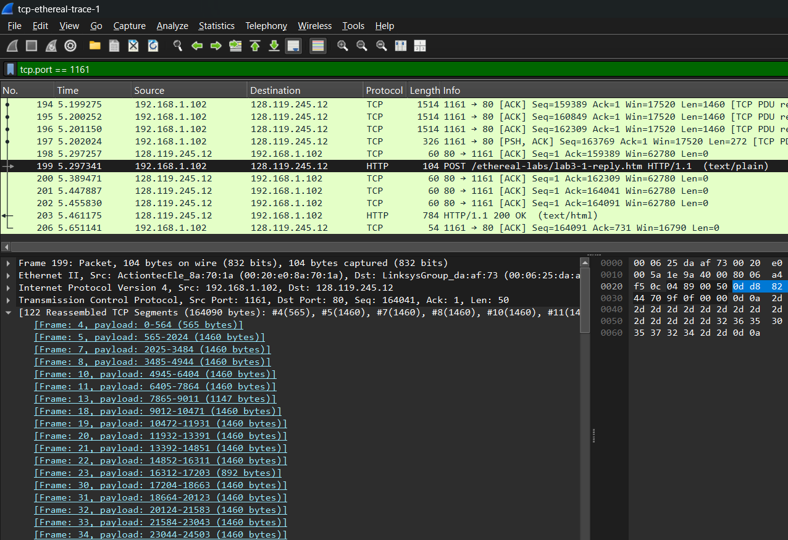

jadi nomor urut 6 segmen pertama sekisar 7865 dimana ia dihitung sesuai urutan seperti gambar dibawah ini. dan terdapat beberapa data tambahan yaitu nilai RTT dihitung dari Waktu ACK diterima - Waktu segmen terkirim sekitar 300 MS yang dimana hasilnya adalah Nilai estimasi

berikut adalah rtt graph:

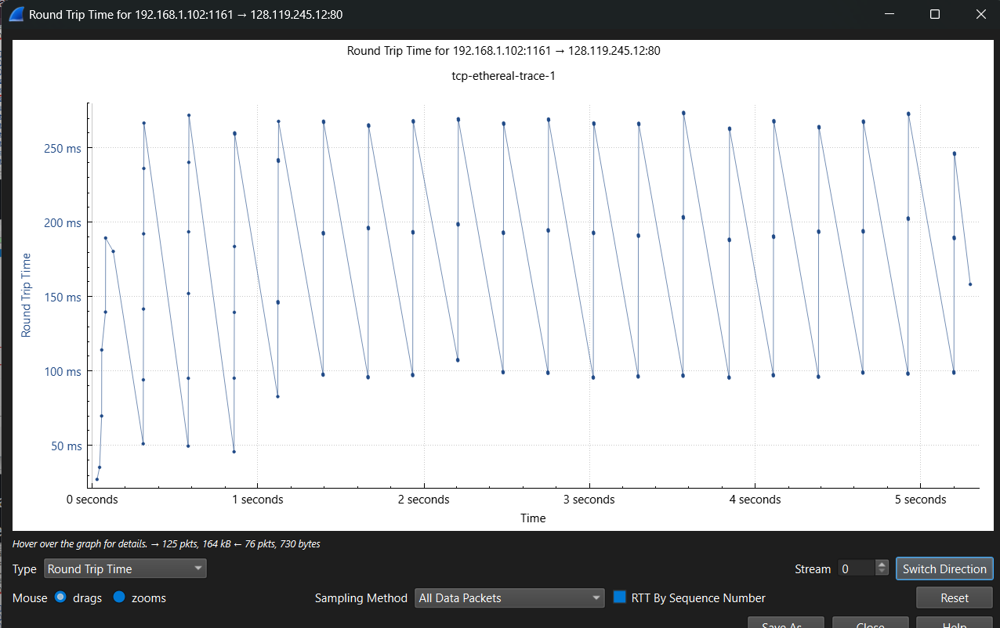

5. Berapa panjang setiap enam segmen TCP pertama?

panjang TCP yang pertama adalah 7865 ,dihitung dari data yang ada yaitu 565 dan 1460

6. Berapa jumlah minimum ruang buffer tersedia yang disarankan kepada penerima dan diterima untuk seluruh trace? Apakah kurangnya ruang buffer penerima pernah menghambat pengiriman?

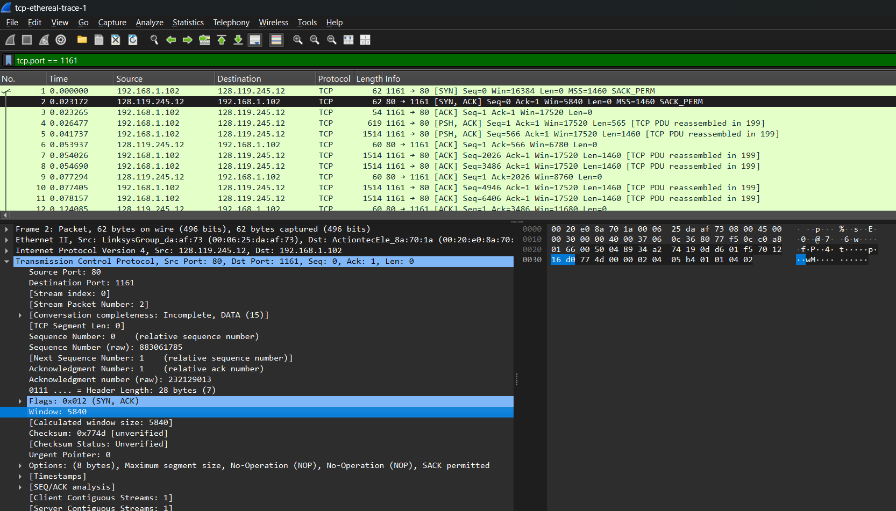

minimum ruang buffer 5840, tidak karena tidak berpengaruh pada kecepatan pengiriman

7. Apakah ada segmen yang ditransmisikan ulang dalam file trace? Apa yang anda periksa (di dalam file trace) untuk menjawab pertanyaan ini?

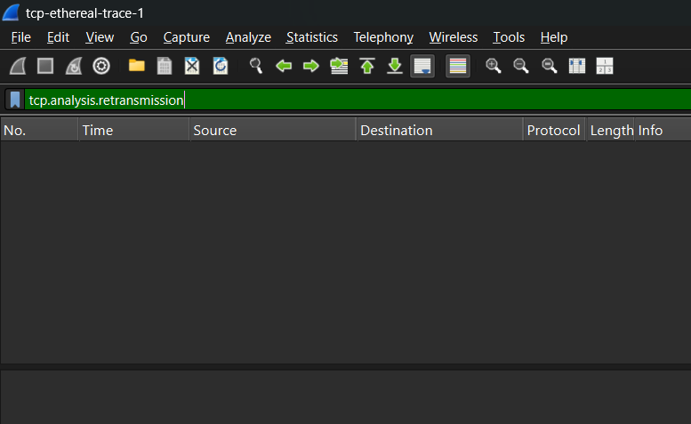

tidak ada

8. Berapa banyak data yang biasanya diakui oleh penerima dalam ACK? Dapatkah anda mengidentifikasi kasus-kasus di mana penerima melakukan ACK untuk setiap segmen yang diterima?

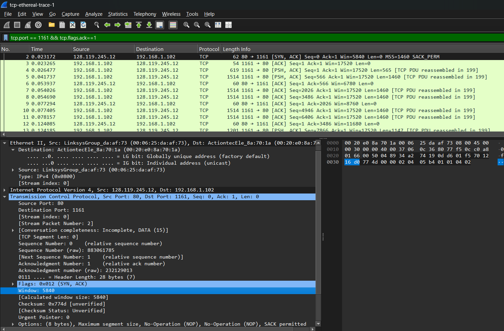

perti pada gambar di atas ini dimana misal jika nilai ack sebesar 7866 ke 9013 maka nilai yang di ACK adalah 1147 byte. disini menggunakan selisih nomor pada ACK.

9. Berapa throughput (byte yang ditransfer per satuan waktu) untuk sambungan TCP? Jelaskan bagaimana Anda menghitung nilai ini.

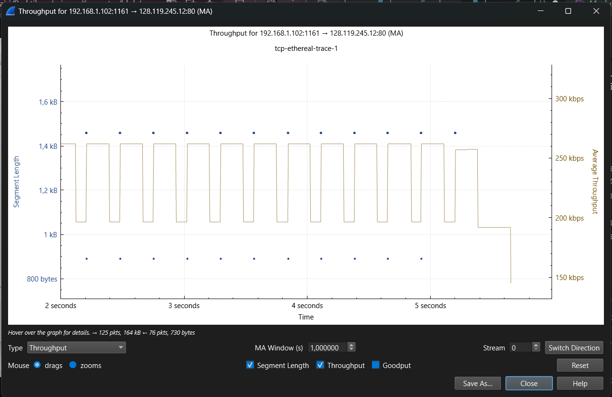

throughput berada di kisaran 170=270 kbps dari gambar diatas

## Congestion Control pada TCP
Disini akan melakukan implementasi pemeriksaan jumlah data yang dikirim per satuan waktu dari klien ke server. Kita akan menggunakan salah satu fitur grafik TCP Wireshark ‒Time-Sequence-Graph(Stevens)‒ untuk memplot data. seperti gambar dibawah ini memilih segmen TCP yang dikirim klien di jendela "daftar paket yang diambil" Wireshark. Kemudian memilih menu Statistics->TCP Stream Graph-> Time-Sequence-Graph (Stevens). disini maka setiap titik mewakili segmen TCP yang dikirim, memplot nomor urut segmen dibandingkan dengan waktu pengirimannya. berikut implementasi yang bisa dimuat adalah.
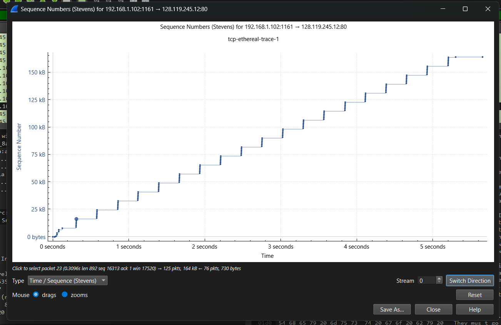