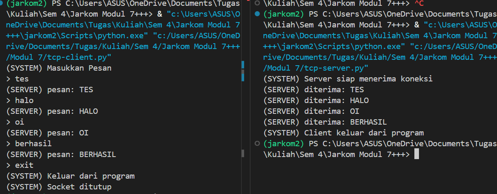
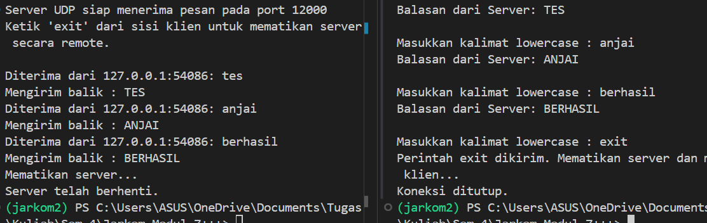

# Laporan Praktikum Jaringan Komputer Modul 7
SOCKET PROGRAMMING: MEMBUAT APLIKASI JARINGAN

# Tujuan Praktikum
1. Mahasiswa bisa membuat program berbasis socket UDP
2. Mahasiswa bisa membuat program berbasis socket TCP

## TCP
### TCP Client
Code:
```python
# SOCKET = Perkalian pembagian pengurangan penjumlahan
from socket import *

serverName = 'localhost'
serverPort = 12000 

clientSocket = socket(AF_INET, SOCK_STREAM) # AF_INET = IPv4, SOCK_STREAM = TCP

clientSocket.connect((serverName, serverPort))

print("(SYSTEM) Masukkan Pesan")

running = True
while running:
    #input
    message = input('> ')

    #mengirim ke server
    #encodde = mengubah string menjadi bytes
    clientSocket.send(message.encode())

    # kalo exit = socket ditutup
    if message.lower() == 'exit':
        print("(SYSTEM) Keluar dari program")
        running = False
        break


    #menerima pesan dari server
    modifiedMessage = clientSocket.recv(2048)

    #decode = mengubah bytes menjadi string
    print("(SERVER) pesan: " + modifiedMessage.decode())

# tutup socket
clientSocket.close()
print("(SYSTEM) Socket ditutup")
```

### TCP Server
Code:
```python
from socket import *

serverPort = 12000
serverSocket = socket(AF_INET, SOCK_STREAM) # AF_INET = IPv4, SOCK_STREAM = TCP

#mengbind server 
serverSocket.bind(('', serverPort))

#server siap menerima koneksi
serverSocket.listen(1)
print("(SYSTEM) Server siap menerima koneksi")

running = True
while running:
    connectionSocket, addr = serverSocket.accept() # menerima koneksi dari client

    while True:
        message = connectionSocket.recv(2048).decode() # menerima pesan dari client

        if not message:
            break

        if message.lower() == 'exit':
            print("(SYSTEM) Client keluar dari program")
            running = False
            break

        #memodifikasi menjadi capslock
        ModifiedMessage = message.upper()
        print("(SERVER) diterima: " + ModifiedMessage)

        # kirim ke client
        connectionSocket.send(ModifiedMessage.encode())

    connectionSocket.close() # tutup koneksi dengan client

serverSocket.close() # tutup socket server
```
1. Untuk Menjalankan program pastikan sudah menjalankan virtual environment
2. lalu jalankan tcp server, lalu tcp client pastikan dua duanya berjalan bersamaan
3. coba kirim pesan melalui terminal client
4. server akan menerima pesan dari client
5. ketik exit untuk memutuskan koneksi
contoh output:



## UDP
### UDP Client
Code:
```python
from socket import *
import sys

# Konfigurasi alamat dan port server
serverName = '10.124.124.62'
serverPort = 12000

# Inisialisasi socket UDP di luar loop agar tidak dibuat berulang-ulang
clientSocket = socket(AF_INET, SOCK_DGRAM)
clientSocket.settimeout(5)  # Batas waktu tunggu 5 detik

print("Ketik 'exit' untuk mematikan server dan keluar, atau 'keluar' untuk tutup client saja.\n")

try:
    while True:
        # Input pesan dari pengguna
        message = input('Masukkan kalimat lowercase : ')
        
        # Validasi jika input kosong
        if not message:
            continue

        # Mengirim pesan ke server
        clientSocket.sendto(message.encode(), (serverName, serverPort))
        
        # Cek apakah pengguna ingin keluar
        if message.lower() == 'exit':
            print("Perintah exit dikirim. Mematikan server dan menutup klien...")
            break
        elif message.lower() == 'keluar':
            print("Menutup klien...")
            break
        
        try:
            # Menerima balasan dari server
            modifiedMessage, serverAddress = clientSocket.recvfrom(2048)
            print(f"Balasan dari Server: {modifiedMessage.decode()}\n")
        except timeout:
            print("Kesalahan : Server tidak merespons (Timeout).\n")

except Exception as e:
    print(f"Terjadi kesalahan : {e}")
finally:
    # Menutup koneksi socket secara permanen saat loop berhenti
    clientSocket.close()
    print("Koneksi ditutup.")
```

### UDP Server
```python
from socket import *
import sys

# Konfigurasi server
serverPort = 12000
serverSocket = socket(AF_INET, SOCK_DGRAM)
serverSocket.bind(('', serverPort))

print(f"Server UDP siap menerima pesan pada port {serverPort}")
print("Ketik 'exit' dari sisi klien untuk mematikan server secara remote.\n")

try:
    while True:
        # Menerima pesan dari klien
        message, clientAddress = serverSocket.recvfrom(2048)
        
        # Mendekode pesan
        original_message = message.decode().strip()
        
        # Cek apakah pesan adalah perintah untuk keluar
        if original_message.lower() == 'exit':
            print(f"Mematikan server...")
            break
        
        # Mengubah pesan menjadi huruf kapital
        modifiedMessage = original_message.upper()
        
        # Menampilkan informasi klien dan isi pesan
        print(f"Diterima dari {clientAddress[0]}:{clientAddress[1]}: {original_message}")
        print(f"Mengirim balik : {modifiedMessage}")
        
        # Mengirim kembali pesan yang telah diubah ke klien
        serverSocket.sendto(modifiedMessage.encode(), clientAddress)
        
except Exception as e:
    print(f"\nTerjadi kesalahan : {e}")
finally:
    print("Server telah berhenti.")
    serverSocket.close()
    sys.exit(0)
```
1. Untuk Menjalankan program pastikan sudah menjalankan virtual environment
2. lalu jalankan udp server, lalu udp client pastikan dua duanya berjalan bersamaan
3. coba kirim pesan melalui terminal client
4. server akan menerima pesan dari client
5. ketik exit untuk memutuskan koneksi

contoh output:



