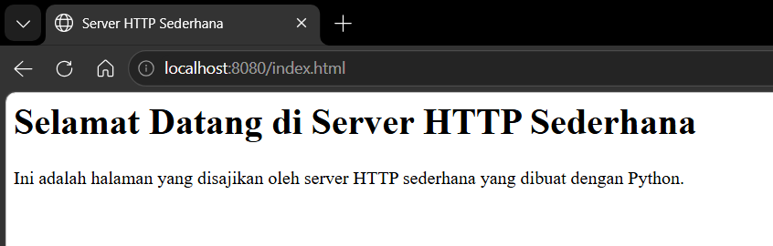

# Laporan Praktikum Jaringan Komputer Modul 9
WEB SERVER

# Tujuan Praktikum
1. Mahasiswa bisa membuat program web server sederhana berbasis TCP socket programming

## Langkah-Langkah
1. Buat file server.py
2. Tulis code sebagai berikut:
```python
from socket import *
import threading

def handle_client(connectionSocket):
    try:
        message = connectionSocket.recv(1024).decode()
        filename = message.split()[1]

        f = open(filename[1:])
        outputData = f.read()

        connectionSocket.send("HTTP/1.1 200 OK\r\n\r\n".encode())
        connectionSocket.sendall(outputData.encode())
        connectionSocket.close()

    except IOError:
        connectionSocket.send("HTTP/1.1 404 Not Found\r\n\r\n".encode())
        connectionSocket.send("<h1>404 Not Found</h1>".encode())
        connectionSocket.close()


serverSocket = socket(AF_INET, SOCK_STREAM)
serverSocket.bind(('', 8080))
serverSocket.listen(5)
print("[SYSTEM] server is running...")

while True:
    connectionSocket, addr = serverSocket.accept()

    thread = threading.Thread(
        target=handle_client,   
        args=(connectionSocket,)
    )
    thread.start()
```

3. Buat file index.html di folder yang sama
4. contoh isi file:
```
<html>
    <head>
        <title>Server HTTP Sederhana</title>
    </head>
    <body>
        <h1>Selamat Datang di Server HTTP Sederhana</h1>
        <p>Ini adalah halaman yang disajikan oleh server HTTP sederhana yang dibuat dengan Python.</p>
    </body>
</html>
```

5. jalankan file server.py tadi
6. lalu pergi ke web browser dan masuk ke http://localhost:8080/index.html
7. akan muncul file index.html tadi seperti ini

