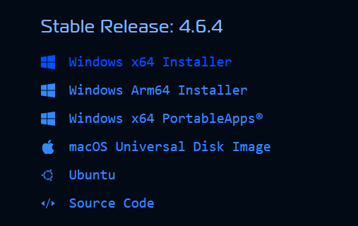
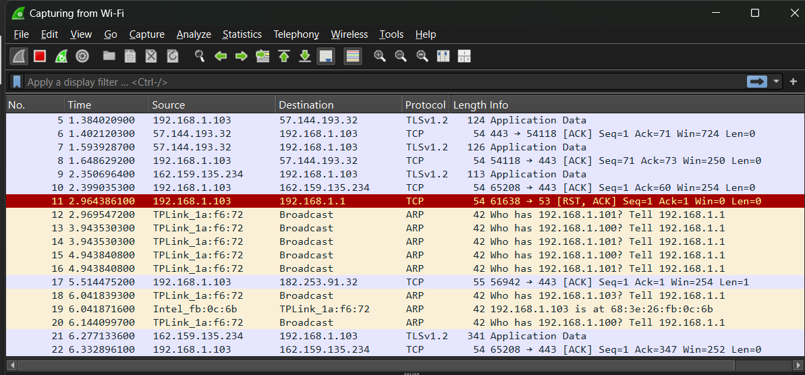

# Laporan Praktikum Jaringan Komputer Modul 1
Running modul - Instalasi wireshark dan Python

# Tujuan Praktikum
1. Mahasiswa mengetahui aturan dan sistem pelaksanaan praktikum
2. Mahasiswa mengetahui tools yang akan digunakan dan memastikan tools berfungsi dengan baik selama pelaksanaan pratikum 

# Langkah-Langkah 
1. Install wireshark  [disini](https://www.wireshark.org/#download)
2. Lalu pilih versi sesuai device 

3. setelah download installernya, run installernya dan tekan next dan atur instalasi sesuai preferensi
4. setelah wireshark selesai di install, buka aplikasi nya
5. lalu kita akan menguji  capture dengan memilih wifi

6. jika kelihatan trafficnya maka penginstalan wireshark sudah benar
