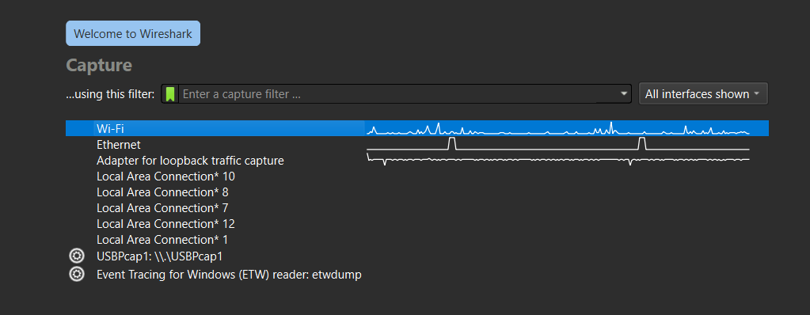
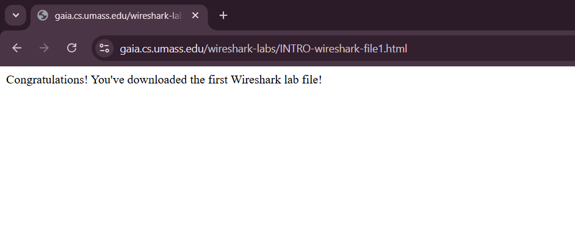
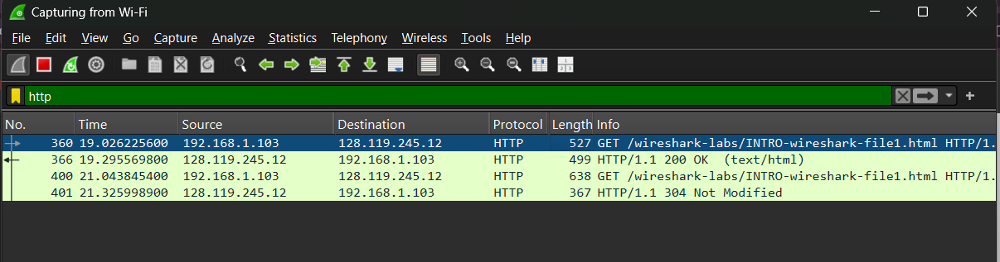
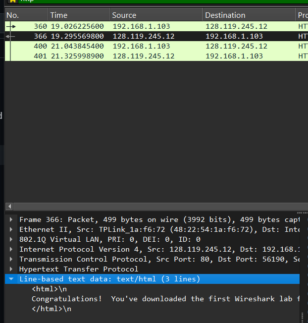

# Laporan Praktikum Jaringan Komputer Modul 2
Pengenalan Tools - Uji coba capture HTTP Traffic dengan wireshark

# Tujuan Praktikum
1. Mahasiswa dapat melakukan instalasi tool yang digunakan (Wireshark).
2. Mahasiswa dapat menggunakan tool (Wireshark) untuk menangkap dan mengidentifikasi paket data.

# Langkah-Langkah
1. jalankan aplikasi wireshark dan pilih capture wifi

2. lalu buka web browser dan ketik URL: http://gaia.cs.umass.edu/wireshark-labs/INTRO-wireshark-file1.html

3. lalu ketik http pada bagian atas dan cari pesan GET /wireshark-labs/INTRO-wireshark-file1.html HTTP/1.1 

4. double click pada response in frame

5. lalu klik Line-based text data

