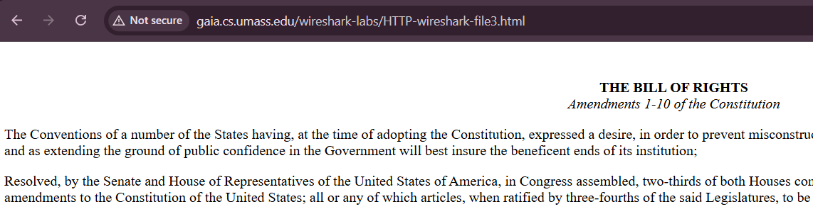
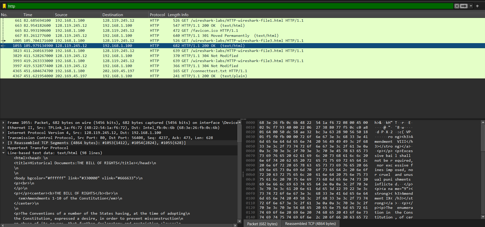
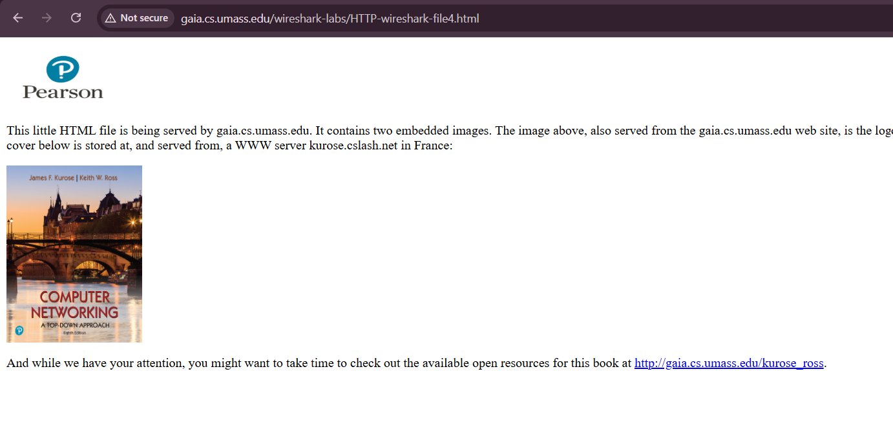
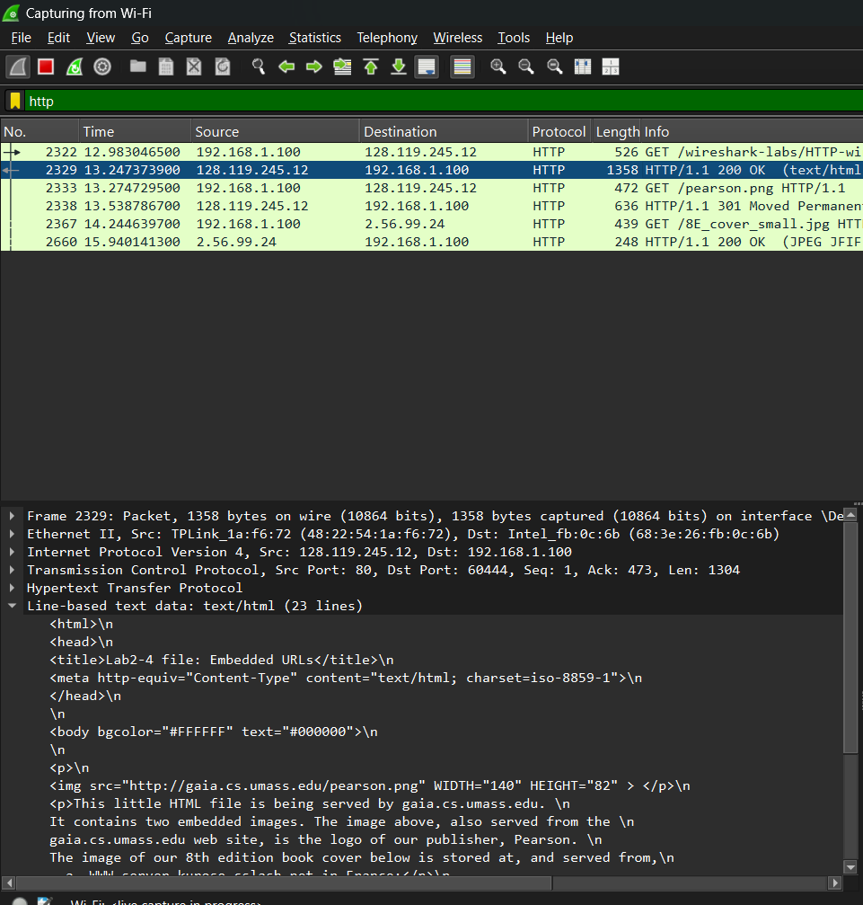
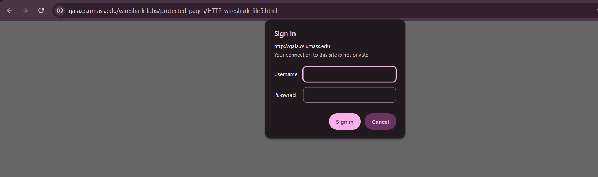
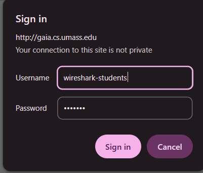
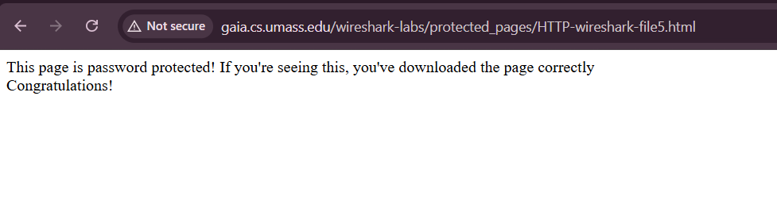
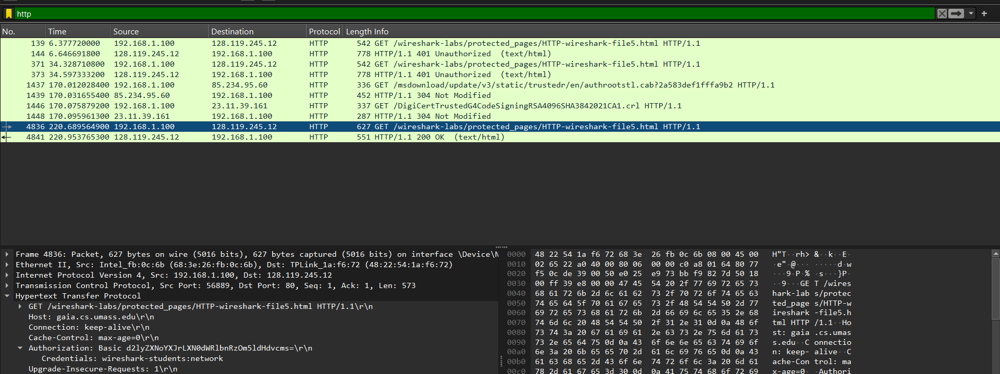

# Laporan Praktikum Jaringan Komputer Modul 3
HTTP - Analisis HTTP Packet

# Tujuan Praktikum
1. Mahasiswa dapat menginvestigasi cara kerja protokol HTTP menggunakan Wireshark.

# Langkah-Langkah
1. Jalankan Aplikasi Wireshark dan pilih capture wifi

2. Lalu Buka URL: http://gaia.cs.umass.edu/wireshark-labs/HTTP-wireshark-file3.html pada browser pastikan http dan muncul not secure seperti ini

3. Kembali ke wire shark dan ketik http pada bagian atas dan amati response nya

4. Lalu Buka URL: http://gaia.cs.umass.edu/wireshark-labs/HTTP-wireshark-file4.html pada browser pastikan http

5. Perhatikan lagi response nya pada wireshark

6. Lalu Buka URL: http://gaia.cs.umass.edu/wireshark-labs/protected_pages/HTTP-wireshark-file5.html pada browser, akan muncul tampilan login seperti ini

7. Masukkan username wireshark-students dan password network

pastikan muncul seperti dibawah ini setelah sign in

8. Lihat lagi response nya di wireshark

disini kita bisa melihat username dan password dapat dicapture
